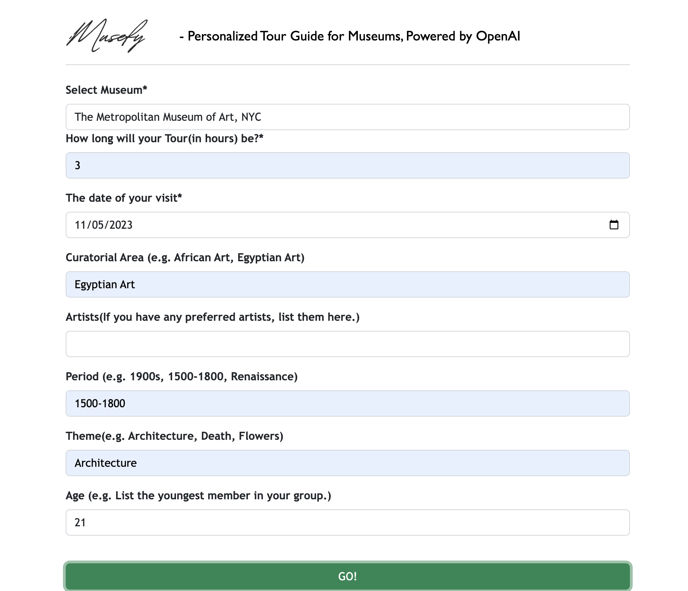

# Musefy Project Overview

# Summary
Our goal is to craete an app personalizing the museum tour for people by leveraging the AI inside our technology.

# Our Homepage

### By choosing your journey to have a unique and personalized museum tour guide



### Example output


# File Path
```sh
└── Personalized-MET-Tour-Guide/
    └── METTour/
        ├── METTour/
        │   ├── asgi.py
        │   ├── settings.py
        │   ├── urls.py
        │   └── wsgi.py
        ├── TourGuide/
        │   ├── admin.py
        │   ├── apps.py
        │   ├── forms.py
        │   ├── gptutilize.py
        │   ├── migrations/
        │   ├── models.py
        │   ├── templates/
        │   ├── tests.py
        │   └── views.py
        ├── db.sqlite3
        └── manage.py

```

# How to Use

## git clone project
```bash
git clone https://github.com/ellenfan2000/Musefy.git
```

## set up requirements.txt

```bash
aiohttp==3.8.6
aiosignal==1.3.1
annotated-types==0.6.0
anyio==3.7.1
asgiref==3.7.2
async-timeout==4.0.3
asyncio==3.4.3
attrs==23.1.0
backoff==2.2.1
black==23.3.0
cachetools==5.3.2
certifi==2023.7.22
cfgv==3.4.0
charset-normalizer==3.3.2
click==8.1.7
colorlog==6.7.0
crispy-bootstrap4==2023.1
dataclasses-json==0.5.7
deprecation==2.0.7
diskcache==5.6.3
distlib==0.3.7
Django==4.2.7
django-crispy-forms==2.1
docker==6.1.3
exceptiongroup==1.1.3
filelock==3.13.1
FLAML==2.1.1
frozenlist==1.4.0
gitdb==4.0.11
GitPython==3.1.40
gpt-engineer==0.0.9
h11==0.14.0
h2==4.1.0
hpack==4.0.0
httpcore==0.17.3
httpx==0.24.1
hyperframe==6.0.1
identify==2.5.31
idna==3.4
iniconfig==2.0.0
jsonpatch==1.33
jsonpointer==2.4
langchain==0.0.330
langsmith==0.0.57
marshmallow==3.20.1
marshmallow-enum==1.5.1
monotonic==1.6
multidict==6.0.4
mypy==1.3.0
mypy-extensions==1.0.0
nodeenv==1.8.0
numpy==1.26.1
openai==0.27.8
packaging==23.2
pathspec==0.11.2
platformdirs==3.11.0
pluggy==1.3.0
pre-commit==3.3.3
pyautogen==0.1.14
pydantic==1.10.13
pydantic_core==2.10.1
pytest==7.3.1
python-dateutil==2.8.2
python-dotenv==0.21.1
PyYAML==6.0.1
readmeai==0.4.49
regex==2023.10.3
requests==2.31.0
responses==0.23.3
rudder-sdk-python==2.0.2
ruff==0.0.272
six==1.16.0
smmap==5.0.1
sniffio==1.3.0
SQLAlchemy==2.0.23
sqlparse==0.4.4
tabulate==0.9.0
tenacity==8.2.3
termcolor==2.3.0
tiktoken==0.4.0
toml==0.10.2
tomli==2.0.1
tornado==6.3.3
tqdm==4.66.1
typer==0.9.0
types-PyYAML==6.0.12.12
typing-inspect==0.9.0
typing_extensions==4.8.0
urllib3==2.0.7
virtualenv==20.24.6
websocket-client==1.6.4
yarl==1.9.2
```

## run server

```bash
python3 manage.py runserver
```

